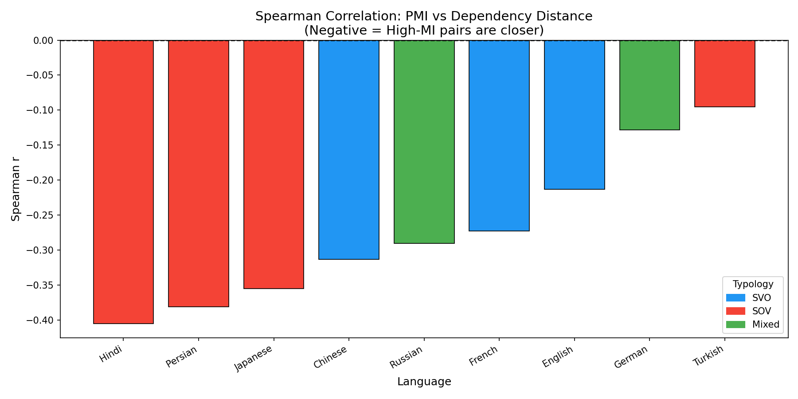
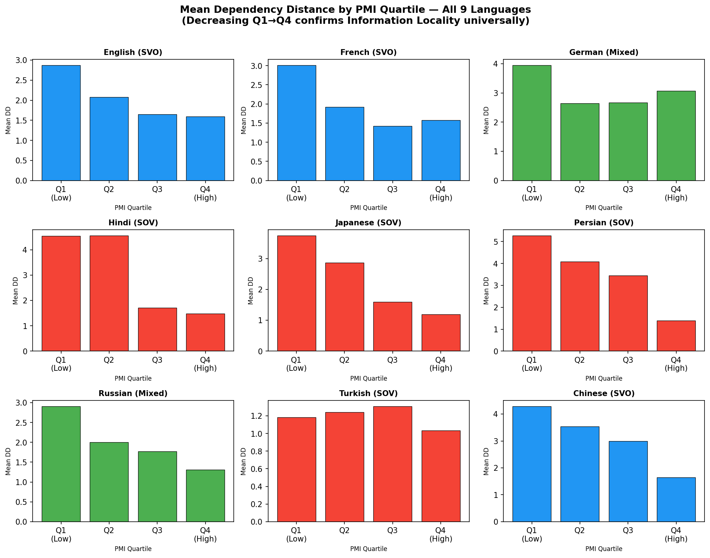

# Information Locality and Dependency Distance
### A Cross-Linguistic Corpus Study Using Mutual Information
**CGS410 — Computational Linguistics, IIT Kanpur**
**Sneha Kumari (241024)**

---

## Research Question

> *Do words that are strongly associated with each other (high Mutual Information) tend to appear closer together in sentences — and is this true across typologically different languages?*

This project tests the **Information Locality principle** using syntactically annotated corpora across **9 languages**, spanning SVO, SOV, and Mixed word-order typologies.

---

## Key Results

| Language | Typology | Spearman ρ | p-value |
|----------|----------|------------|---------|
| Hindi    | SOV      | −0.405     | 1.78×10⁻⁵⁸ |
| Persian  | SOV      | −0.381     | <10⁻³⁰⁰ |
| Japanese | SOV      | −0.355     | <10⁻³⁰⁰ |
| Chinese  | SVO      | −0.313     | 3.61×10⁻²⁹¹ |
| Russian  | Mixed    | −0.290     | <10⁻³⁰⁰ |
| French   | SVO      | −0.273     | <10⁻³⁰⁰ |
| English  | SVO      | −0.213     | <10⁻³⁰⁰ |
| German   | Mixed    | −0.128     | 8.14×10⁻¹³⁸ |
| Turkish  | SOV      | −0.095     | 4.71×10⁻⁹ |

**All 9 languages show a significant negative correlation** — high-MI pairs consistently appear at shorter dependency distances. Total dataset: **490,426 head-dependent pairs**.

---

## Repository Structure

```
├── CGS410_project.ipynb       # Full analysis notebook (Google Colab)
├── src/
│   ├── load_corpus.py         # Load and parse SUD .conllu files
│   ├── extract_pairs.py       # Extract head-dependent arcs + DD
│   ├── compute_pmi.py         # Compute Pointwise Mutual Information
│   ├── correlation.py         # Spearman correlation + LMM
│   └── visualize.py           # Generate all plots
├── results/
│   ├── correlation_results.csv
│   ├── correlation_by_language.png
│   └── correlation_by_typology.png
├── report/
│   └── CGS410_report.pdf      # Final submitted report
└── README.md
```

---

## Methodology

### Pipeline

```
SUD Corpus (.conllu)
        │
        ▼
  Arc Extraction          → (head_word, dep_word, position_head, position_dep)
        │
        ▼
  Dependency Distance     → DD(h,d) = |pos(h) − pos(d)|
        │
        ▼
  PMI Computation         → PMI(h,d) = log₂[P(h,d) / P(h)·P(d)]
        │
        ▼
  Spearman Correlation    → ρ(PMI, DD) per language
        │
        ▼
  Mixed-Effects Model     → DD ~ PMI + Typology + (1|Language)
        │
        ▼
  Typological Comparison  → SVO vs SOV vs Mixed
```

### Data
- **Source:** [Surface-Syntactic Universal Dependencies (SUD)](https://surfacesyntacticud.github.io/data/)
- **Languages:** English, French, Chinese (SVO) · Hindi, Japanese, Persian, Turkish (SOV) · German, Russian (Mixed)
- **Filter:** Minimum pair frequency = 5; punctuation and root arcs excluded

### Statistical Methods
- **Spearman's ρ** — non-parametric rank correlation, robust to skewed distributions
- **Linear Mixed-Effects Model** — PMI coefficient = −0.214 (z = −130.49, p < 0.001)

---

## Findings

1. **H1 Confirmed:** All 9 languages show significant negative ρ(PMI, DD) — information locality is universal.
2. **H2 Reversed:** SOV languages show *stronger* effects than SVO (median |ρ| = 0.368 vs 0.266), suggesting lexical associations compensate for structurally imposed long arcs in head-final grammars.
3. **Turkish outlier:** Agglutinative morphology weakens word-level PMI–distance correlation (ρ = −0.095).

---

## How to Run

### Requirements
```bash
pip install conllu pandas scipy statsmodels matplotlib seaborn
```

### Data Download
Download SUD treebanks from: https://surfacesyntacticud.github.io/data/
Place `.conllu` files in the working directory.

### Run the notebook
Open `CGS410_project.ipynb` in [Google Colab](https://colab.research.google.com) or Jupyter.

Or run individual modules:
```bash
python src/load_corpus.py
python src/extract_pairs.py
python src/compute_pmi.py
python src/correlation.py
python src/visualize.py
```

---

## References

- Futrell et al. (2015). Large-scale evidence of dependency length minimization in 37 languages. *PNAS*.
- Gibson (2000). The dependency locality theory. *Image, Language, Brain*. MIT Press.
- Gildea & Jaeger (2015). Human languages order information efficiently. *arXiv:1510.02057*.
- Kahane et al. (2017). SUD: Surface Syntactic Universal Dependencies. *TLT16*.
- Levy (2008). Expectation-based syntactic comprehension. *Cognition*.
- Liu (2008). Dependency distance as a metric of language comprehension difficulty. *Journal of Cognitive Science*.

## Additional Analysis

### Mean DD Reduction: Low PMI vs High PMI Pairs

| Language | Typology | Mean DD (Low PMI) | Mean DD (High PMI) | % Reduction |
|----------|----------|-------------------|-------------------|-------------|
| Hindi    | SOV      | 4.555             | 1.596             | **65.0%**   |
| Japanese | SOV      | 3.317             | 1.393             | **58.0%**   |
| Persian  | SOV      | 4.684             | 2.426             | **48.2%**   |
| Chinese  | SVO      | 3.918             | 2.316             | **40.9%**   |
| French   | SVO      | 2.468             | 1.499             | **39.3%**   |
| Russian  | Mixed    | 2.458             | 1.537             | **37.5%**   |
| English  | SVO      | 2.479             | 1.625             | **34.4%**   |
| German   | Mixed    | 3.297             | 2.873             | **12.9%**   |
| Turkish  | SOV      | 1.211             | 1.172             | **3.3%**    |

> High-PMI pairs show dramatically shorter dependency distances across all languages.
> Hindi shows the strongest effect — high-MI pairs are placed **65% closer** than low-MI pairs.

### Figures



---

*Course project for CGS410, IIT Kanpur, April 2026.*
